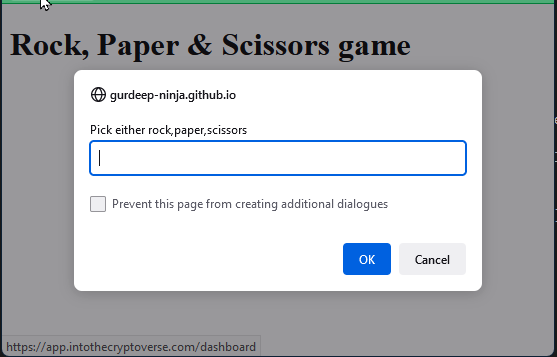
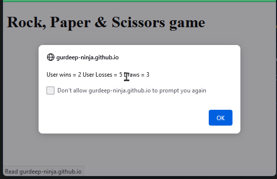

# Rock, Paper & Scissors Game

## Description

A simple JavaScript game that prompts the players to select either rock, paper or scissors.

The game will then compare the players choice against the computer and calculate the result

After 10 games, a score card displayed to the player with total Wins, Loses & Draws. 

The player is asked if they would like to play again too.

## Live demo

[View deployed application on Github Pages](https://gurdeep-ninja.github.io/Rock-Paper-Scissors-Game/)

## Screenshot

## Installation & running the game

Clone or download this project as a zip file & extract to your websites root directory.

Simply open the `index.html` file in your browser and the game will start

## Technologies
  